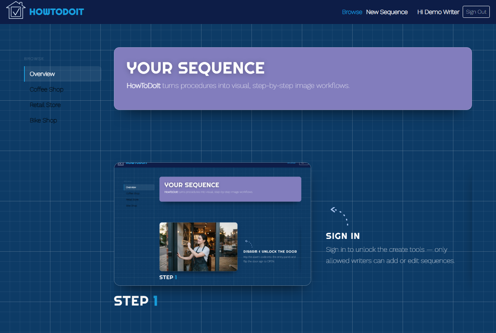
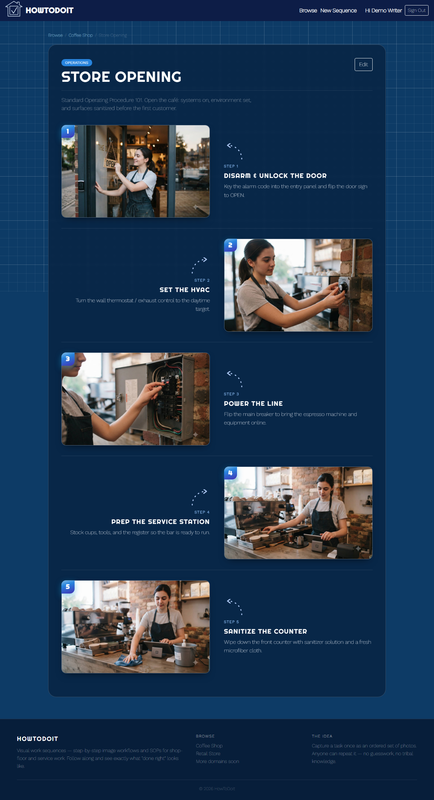

# HowToDoIt

**HowToDoIt** is a lean platform for **visual work sequences** — step-by-step image
workflows and standard operating procedures (SOPs) for shop-floor, service, and
trade work. Capture a task once as an ordered set of photos with short
descriptions; anyone can then follow along and see exactly what "done right" looks
like — no guesswork, no tribal knowledge.

**Live:** https://howtodoit-api.azurewebsites.net





## How it works

- **Browse (public, no login):** a scrollytelling splash groups sequences by
  **domain** (e.g. Coffee Shop, Retail Store, Bike Shop). Open any sequence to see
  its numbered steps, each with its photos and a short description.
- **Create (writer only):** the owner signs in and builds sequences — add steps,
  upload and reorder images, edit descriptions, group by category.

### Domain model

```
Domain  ─┐
Category ─┤→ WorkSequence ──1:N──> WorkStep ──1:N──> StepImage
```

A **WorkSequence** is one SOP; it has ordered **WorkStep**s, each with ordered
**StepImage**s. Sequences carry a `Domain` (top-level grouping) and an optional
`Category`. Deleting cascades sequence → steps → images.

## Stack

- **Frontend:** React 18, TypeScript, Vite, TanStack React Query, Reactstrap, SCSS
- **Backend:** .NET 8 (C#), Entity Framework Core
- **Database:** Azure SQL — HowToDoIt's tables live under the **`howtodoit` schema**
  (with their own migrations-history table), sharing the physical database with the
  separate Household app (`dbo.*`) while staying fully isolated
- **Auth:** Microsoft Entra External ID (MSAL, Google sign-in; JWT Bearer validated
  by the API)
- **Storage:** Azure Blob Storage (image uploads via the API, public-read container)
- **Hosting:** a single Azure **App Service** serves both the React SPA (from
  `wwwroot`) and the `/api`; CI via Azure Pipelines

## Access model (single-writer)

Reads are anonymous so anyone can browse. Writes (POST/PUT/PATCH/DELETE) require an
authenticated caller **whose email is in `Auth:AllowedWriters`** — enforced
server-side by `RequireAuthForWritesFilter` (401 if unauthenticated, 403 if not on
the list). The UI allow-list is UX-only; the server is the authority.

> Entra External ID only emits an `email` claim on access tokens when it's added as
> an optional claim on the API app registration. If a valid login gets 403 on write,
> add `email` (and/or `preferred_username`) as an optional claim.

## Getting started (local)

**Prerequisites:** Node 22.x, .NET 8 SDK, SQL Server **LocalDB** (ships with Visual
Studio). Blob storage / Azurite are only needed to test *uploads* — browsing works
without them.

**Backend** (terminal 1):
```bash
dotnet dev-certs https --trust        # one-time, so the browser trusts localhost:5001
cd HowToDoItApp/HowToDoItApp
dotnet run                            # https://localhost:5001
```
On first run in Development it creates a `HowToDoItDev` LocalDB database, applies the
migration (the `howtodoit` schema + tables), and **seeds three example domains** — so
the app is browsable immediately. Idempotent on subsequent runs.

**Frontend** (terminal 2):
```bash
cd HowToDoIt.ui
npm ci
npm run serve                         # http://localhost:3000
```

Open **http://localhost:3000**. Seed images are served from `HowToDoIt.ui/public/seed/`.

### Configuration

Local dev uses `HowToDoItApp/HowToDoItApp/appsettings.Development.json` (LocalDB
connection, dev storage). The prod SPA calls the same-origin `/api`
(`HowToDoIt.ui/.env.production`). Entra values for sign-in come from `VITE_ENTRA_*`
env vars at build time.

## Testing

```bash
cd HowToDoItApp && dotnet test        # backend (xUnit) — incl. the write-filter tests
cd HowToDoIt.ui && npm test           # frontend (Vitest)
```

## Deploying to Azure

The app deploys as a **single App Service** (`howtodoit-api`) that serves the SPA and
the API together (one URL, no CORS). It reuses the shared SQL server, storage
account, and Entra tenant; `infra/main.bicep` is parameterized (plan/app/container
names, `Auth:AllowedWriters`, and a `createAppServicePlan` toggle to share
Household's plan or provision a dedicated one).

High-level manual deploy:
1. `az deployment group create --template-file infra/main.bicep --parameters createAppServicePlan=false appServicePlanName=household-plan apiAppName=howtodoit-api` (provisions the App Service on the shared plan + the images container). Set `ConnectionStrings__DefaultConnection` on the app.
2. `dotnet publish -c Release`, copy the built SPA (`HowToDoIt.ui/build/*`) into the publish output's `wwwroot/`, zip it (use **forward-slash** paths), and deploy via run-from-package.
3. The app migrates + seeds on first start.

**Notes learned in prod:** the connection string needs `TrustServerCertificate=True`
(newer App Service Linux/OpenSSL-3 ↔ Azure SQL TLS), and deployment zips must use
forward-slash entry paths (Windows PowerShell's `Compress-Archive` writes backslashes
that Linux can't read as folders).

---

*Pivoted from the Household/Playbook codebase — ~40% reused (Entra auth, the
write-gating filter, the Blob upload pipeline, infra) with the chore/household domain
stripped and replaced by the work-sequence model.*
